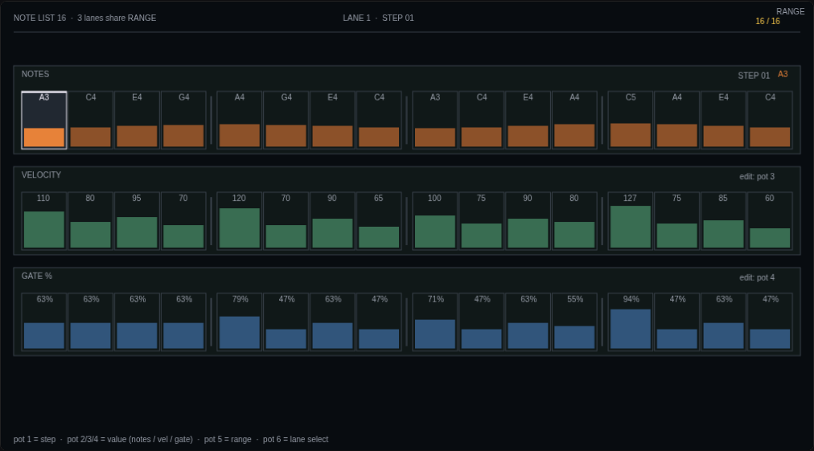

# 16-Step Note List

> **Credits** · Original · electraone-widgets design system · License: MIT

## What it does

A 16-step custom step-list editor inspired by the Waldorf Q-style arpeggiator and the **forum request from NewIgnis** ([Looking for a 16-step custom control for arp and seq](https://forum.electra.one/t/looking-for-a-16-step-custom-control-for-arp-and-seq/4425)). Each "lane" is a 6×1 custom tile holding 16 cells, grouped every 4 by a thin BORDER tick. Values are displayed directly in-cell (note names, raw 0..127, percentages, or any custom **overlay** label table), with no fader bars — just a thin gauge underneath each cell as a visual cue.

The demo wires two lanes — **NOTES** (top) and **VELOCITY** (bottom) — sharing a common `RANGE`. The widget is designed to scale up to **6 lanes per screen** (= 96 step parameters), although the firmware constraints noted below limit interaction patterns.



## Required tiles

| Ref | Name | Type | Slot | Size | Notes |
|---|---|---|---|---|---|
| 1 | NOTES | custom | 0 | 6×1 | Top row, full width |
| 2 | VELOCITY | custom | 6 | 6×1 | Second row, full width |

Add a third instance by appending another tile (slot 12, span 6×1) and a new entry in `lanes` in `widget.lua`. The per-lane state tables (`selectedStep`, `dragging`, `muted`, `laneMode`, `potState`) and `preset.onLoad` iterate over `#lanes` so no extra wiring is needed — just discover the firmware-assigned `potEvId` for the new tile by enabling the device logger and turning a pot (the diagnostic `print` in `potLane` reports the `ev.id` it receives) and put that value in the new lane's `potEvId` field.

Per-lane fields:

| Field | Required | Description |
|---|---|---|
| `name` | yes | Display name in the header strip |
| `color` | yes | Accent colour (any `Theme.*`) |
| `kind` | yes | `"note"` / `"pct"` / `"num"` — value formatter when no overlay is set |
| `cells` | yes | 16-entry initial value table (0..127) |
| `paramBase` | yes | Lowest virtual-param number for this lane's steps; step N writes to virtual param `paramBase + N` |
| `potEvId` | yes | `ev.id` the firmware dispatches to this tile's pot (find via diagnostic print). Legacy alias: `encEdit` |
| `targetLane` | no | Which lane this pot operates on (1-based). Default: `self`. Override to get the "top-pot-drives-top-tile" cross-dispatch on the 2-lane layout |
| `gaugeOrientation` | no | `"h"` (default, thin bar at the bottom of each cell) or `"v"` (thin bar on the right edge) |
| `overlay` | no | Custom label table (see below) — overrides `kind` |

## Interaction (firmware 4.1.4 reality)

The forum spec asks for **two encoders dedicated to each control**. **The current firmware only routes one pot per custom tile** (multi-pot custom controls is forum thread #4172 — feature requested but not shipped). We adapt by using a single pot with a mode-switch + touchscreen.

| Input | Effect |
|---|---|
| **Pot rotate (NAV mode, default)** | Navigate the selected step 1..16 |
| **Pot rotate (EDIT mode)** | Change the selected step's value (0..127) |
| **Pot click** (touch the encoder without rotating) | Toggle mode NAV ↔ EDIT |
| **Pot double-click** | Toggle the selected step on/off (mute). Muted cells display `!` in dim grey; the underlying value is preserved so re-muting restores playback. |
| **Tap a cell** | Select that step directly |
| **Drag vertically on a cell** | Edit the value 0..127 |

The mode indicator in the lane header switches between an outlined "NAV" pill and an accent-filled "EDIT" pill.

Pot ↔ tile routing is inverted on this firmware (top physical pot dispatches to bottom tile and vice versa). The widget applies a Lua-side cross-dispatch so that *"top pot controls top lane"* feels intuitive to the user.

## Overlays — defining your own step list

NewIgnis's spec line **"All 16 parameters share the same overlay list"** means: customise the *labels* shown in cells without touching the rendering logic. Define an `overlay` on the lane and the widget will look up step values against it:

```lua
lanes[1] = {
  name = "SCALE", color = Theme.ACCENT,
  cells = { 0, 2, 4, 5, 7, 9, 11, 12, 0, 2, 4, 5, 7, 9, 11, 12 },
  paramBase = 0,
  overlay = {
    { value = 0,  label = "C" },
    { value = 1,  label = "C#" }, { value = 2,  label = "D" },
    { value = 3,  label = "D#" }, { value = 4,  label = "E" },
    { value = 5,  label = "F" },  { value = 6,  label = "F#" },
    { value = 7,  label = "G" },  { value = 8,  label = "G#" },
    { value = 9,  label = "A" },  { value = 10, label = "A#" },
    { value = 11, label = "B" },  { value = 12, label = "C+" },
  },
}
```

Overlay items can also define inclusive `{from, to, label}` ranges for bucketed mappings (e.g., velocity dynamics: pp / p / mp / mf / f / ff). Exact-match wins over range-match when both are defined.

When `overlay` is absent, the widget falls back to the lane's `kind`:
- `"note"` → MIDI note name (C-1..G9)
- `"num"` → raw integer 0..127
- `"pct"` → percent 0..100

## Virtual parameters & MIDI routing

Each lane writes to **16 consecutive virtual parameters** starting at `paramBase + 1`. In the demo:

| Range | Owner |
|---|---|
| 1..16 | NOTES lane (paramBase = 0) |
| 17..32 | VELOCITY lane (paramBase = 16) |

Wire downstream synth CCs / SysEx to these virtual params — the host DAW or a follow-up Lua block reads the values and fires the corresponding notes. Muted steps send `0` over MIDI but keep their stored value internally.

The `commonRange` global (default 16 = all steps active) sets how many of the 16 steps are live. Cells beyond `commonRange` render with a CANVAS background and a dim dot — clearly outside the pattern. The widget already wires `parameterMap.onChange` to follow virtual parameter `PARAM_COMMON_RANGE` (= **33** by default): map any fader or external CC to virtual param 33 on device 1 and the widget repaints live.

The same `parameterMap.onChange` handler also keeps `lane.cells[step]` in sync with each lane's `paramBase + step` virtual params — so an external fader that writes to one of those slots will move the corresponding step in the widget. The reverse direction (widget → external) is filtered by `origin == LUA` to prevent the listener from looping back on its own writes.

## Visual conventions (matches the design system)

- Lane card: `SURFACE` background with a coloured strip on the left edge to identify the lane
- Lane name: UPPERCASE in `TEXT_DIM`, hairline `BORDER` separator underneath
- Mode pill: outlined when NAV, filled with the lane's accent when EDIT
- Active step (selected): `ELEVATED` background, bright `TEXT` outline, signature 2-px top edge in `TEXT`
- Group dividers: 2-px `BORDER` ticks centred between every 4th cell
- Muted step: dim `NEUTRAL_ACCENT` `!` glyph, gauge hidden
- Out-of-range step: `CANVAS` background, dim dot

## Lua code

Paste `lib/theme.lua` at the top of your preset's Lua tab (no primitives required), then [widget.lua](widget.lua). The emulator pre-loads them; the bundler at `scripts/bundle-preset.js` concatenates everything into `demo.preset.json`'s `lua` field for direct upload via `app.electra.one`.

## Conformity to NewIgnis spec — line by line

| Forum line | Status | Notes |
|---|---|---|
| "5-6 slots wide, 1 slot deep" | ✓ | Each lane = 6×1 |
| "16 parameters in a single row" | ✓ | |
| "Grouped every 4 with vertical dividers" | ✓ | BORDER ticks |
| "Shows only bitmaps or values (no faders)" | ◐ | Values are dominant; a thin 4-px gauge bar sits at the bottom of each cell as a visual cue. Comment out the gauge block in `paintLane` if you need strict "no fader". |
| "Custom control name and encoder assignments" | ◐ | Name shown. Encoder assignment is replaced by the mode pill since only one pot is available per tile |
| "Two dedicated encoders per custom control" | ✗ | **Firmware limit**. The widget compensates with a mode-switch pattern + touchscreen interaction |
| "All 16 parameters share the same overlay list" | ✓ | `lane.overlay = { {value, label}, ... }` — exact and range matching |
| "Range control (0-16), exceeding params hidden/darkened" | ✓ | `commonRange`, out-of-range cells render with CANVAS bg + dim dot |
| "All 16 parameters treated as virtual" | ✓ | `paramBase + 1..16` |
| "Remote control via SysEx and MIDI CC callbacks" | ✓ | Via `parameterMap.set(...)` and the tile's `values[].message` |
| "Up to 6 controls per screen" | ◐ | The demo shows 2. Add tiles at slotId 12 / 18 / 24 / 30 to reach 6 |
| "96 parameters / screen" | ◐ | Reachable when scaling to 6 instances |
| "Common params shareable among multiple controls" | ✓ | `commonRange` is a module-level Lua global shared across instances and follows virtual param 33 via the built-in `parameterMap.onChange` handler — external fader controls all lanes at once |
