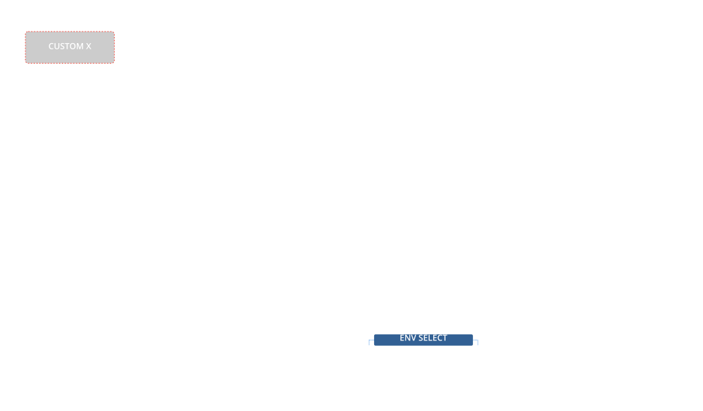

# XT Envelopes — Custom envelope editor

> **Credits** · Original author: **Thomas Moravansky** ([tmoravan@yahoo.com](mailto:tmoravan@yahoo.com)) — Electra One co-founder
> **Source**: https://app.electra.one/preset/GK6wmbgvwM6S3GanpoN7
> **Revision**: 2 · **Imported**: 2026-04-15
> **License at source**: none specified — imported with attribution under the opt-out policy in [NOTICE.md](../../NOTICE.md).

## What it does

A custom control that demonstrates the `paint` / `touch` / `pot` callback system on the Electra One MK2. Implements two envelope modes (`WAVE` 8-point, `FREE` 4-point) with active-point editing, color-coded stages and touch dragging.

The author's stated intent is **pedagogical** — showcase the Custom control type without MIDI plumbing. It's a reference for anyone building their own envelope UI from scratch.

## Preview

## Requirements

- Electra One MK2 firmware ≥ 3.6.0 (`controller.isRequired(MODEL_MK2, "3.6.0")` is asserted at the top of the script).

## Key constants to tune

| Symbol | Default | Meaning |
|---|---|---|
| `WAVEPTS` | 8 | Wave envelope point count |
| `FREEPTS` | 4 | Free envelope point count |
| `SCALEX` | 0.90625 | Horizontal scale of the canvas |
| `SCALEY` | 2 | Vertical scale |
| `WIN_OFST` | 70 | Canvas vertical offset |
| `SUSTAIN` | 64 | Sustain-segment pixel width |
| `STD_COLOR` | `0xB0C0` | Inactive stage color |
| `ACT_COLOR` | `0xFF0000` | Active stage color |

## Integration

Load `demo.preset.json` as-is in the Electra One editor / beta sandbox. The preset bundles the 12 tiles (custom canvas + pads + faders) and this Lua script together.

## Tested on

- Electra One MK2 (per author's compatibility assertion in the script)
- [ ] Re-verify on current firmware
