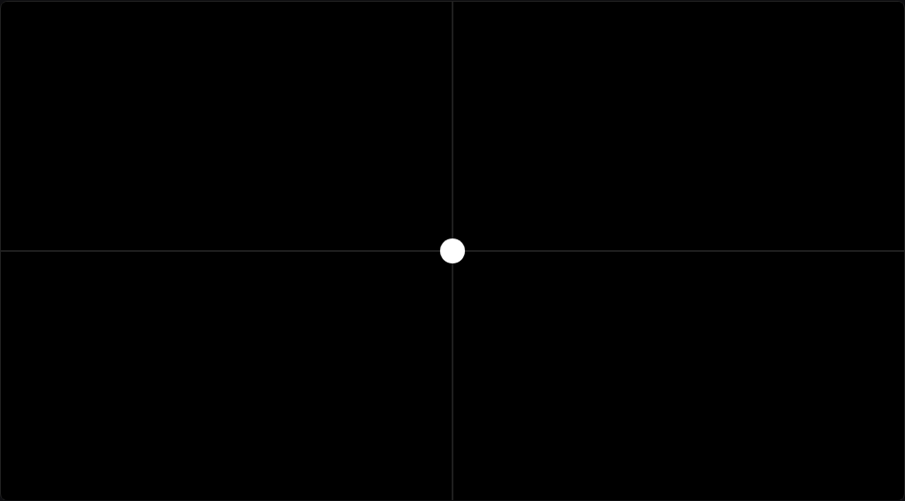

# XY Pad

Two-axis touch pad. Touch/drag on the screen → two normalized values (0..1) sent via an `onChange(x, y)` hook, which you wire to whatever MIDI messages you want (CCs, NRPNs, SysEx).

## Preview



## Integration

```lua
local XYPad = require("widget")
XYPad.onChange = function(x, y)
  midi.sendControlChange(1, 1, 16, math.floor(x * 127))
  midi.sendControlChange(1, 1, 17, math.floor(y * 127))
end

local host = controls.get(1)
host:setPaintCallback(function(c, g) XYPad.paint(c, g) end)
host:setTouchCallback(function(c, e) XYPad.touch(c, e) end)
```

## Parameters

| Field | Type | Default | Description |
|-------|------|---------|-------------|
| `x`, `y` | number (0..1) | 0.5 | Current cursor position |
| `cursorColor` | uint24 RGB | `0xFFFFFF` | Cursor fill |
| `bgColor` | uint24 RGB | `0x202020` | Background |
| `gridColor` | uint24 RGB | `0x404040` | Crosshair |
| `onChange(x,y)` | fn | noop | Called on every touch move |

## Tested on

- [ ] MK2 (pending hardware test)
- [ ] Mini
- [ ] Simulator
